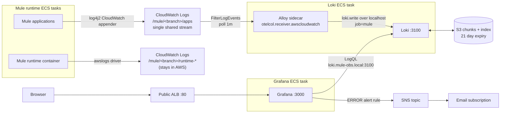

# Mule infra

This project contains infrastructure for running mule runtime in AWS.

It pulls the docker image from ECR from the gn-build account, and runs it in ECS Fargate.

## Docker image

The repo with the docker image is [here](https://github.com/GemeenteNijmegen/mule-docker-image).

To update the docker image version in `mule-infra`, update the `muleDockerImageHash` in `src/Statics.ts`.

## Manual Pre-requisites

For each Mule environment (AWS account), you must configure several secrets and parameters manually before deploying the infrastructure.

### 1. Mule License and Keystores (AWS Secrets Manager)

Store the Mule license and keystore files as **binary secrets**. The required secret names are:
*   `/mule-infra/mule/license`
*   `/mule-infra/mule/truststore`
*   `/mule-infra/mule/keystore`

Example command:
```bash
aws secretsmanager put-secret-value --secret-id '<secret-arn>' --secret-binary fileb:///path/to/file --region eu-central-1
```

Store the corresponding passwords as **string secrets**. The required secret names are:
*   `/mule-infra/mule/truststorepassword`
*   `/mule-infra/mule/keystorepassword`

Example command:
```bash
aws secretsmanager put-secret-value --secret-id '<secret-arn>' --secret-string "your_secret" --region eu-central-1
```

### 2. Anypoint Platform Credentials

Set up your Anypoint credentials using both SSM Parameters and AWS Secrets Manager.

**AWS Systems Manager (SSM) Parameters (Type: String):**
*   `/mule-infra/mule/anypoint-client-id`
*   `/mule-infra/mule/anypoint-org-id`
*   `/mule-infra/mule/anypoint-env-id`

> [!TIP]
> We recommend using the AWS Management Console (Systems Manager -> Parameter Store) to create and update these parameters.

**AWS Secrets Manager (Type: String):**
*   `/mule-infra/mule/anypoint-client-security` (This stores the client secret)

Example command:
```bash
aws secretsmanager put-secret-value --secret-id '<secret-arn>' --secret-string "your_client_secret" --region eu-central-1
```

### 3. Application Load Balancer (ALB) Truststore

You must store the `truststore.pem` file containing public certificates in the designated S3 bucket for the ALB. 

> [!WARNING]  
> If the `.pem` file is updated, you must replace it in the S3 bucket and also manually update the truststore on the corresponding EC2 instances to ensure they use the new version.

## Infrastructure

When you push a change to the development, acceptance or main branch, the following happens:

### Initial setup & deploy

**Prerequisites**:
- In the build account, the docker image is present in ECR.
- The stack is deployed to AWS (for ssm and secrets manager creation).
- The manual pre-requisites are done.

**Registering the server**:
Registration now works with the mule cli and is handled purely in the docker entrypoint. No need for manual steps for server registration.
- Fargate pulls the image from ECR.
    - The `ANYPOINT_CLIENT_SECRET` is read from AWS Secrets Manager.
    - The `ANYPOINT_CLIENT_ID`, `ANYPOINT_ORG_ID`, and `ANYPOINT_ENV_ID` are read from AWS SSM Parameter Store.
    - The server registration is executed automatically using the API in the `entrypoint.sh` script during the initial startup.
        - The generated `${MULE_HOME}/conf/mule-agent.yml` file, along with the Mule apps, is stored on an attached EFS volume. This ensures the configuration persists across container restarts and deployments, so the server only needs to be registered once.
- The service is updated.

## Logging

Mule **application** logs and Mule **runtime/system** logs are kept apart at the
storage level, not by filtering after the fact:

| Logs | Written by | Lands in |
| --- | --- | --- |
| Application | the app's own log4j2 CloudWatch appender | `/mule/<branch>/apps`, one shared stream, 6 months |
| Runtime / system | the ECS `awslogs` driver on stdout | `/mule/<branch>/runtime-N`, one group per task, 1 month |

Every application and every task writes to the **same** stream in the app group,
so a correlation ID is readable in one place instead of being spread across the
per-task runtime groups. The group name and stream name reach the containers as
`MULE_APP_LOG_GROUP` / `MULE_APP_LOG_STREAM`; both derive from
`Statics.muleAppLogGroupName()` so the runtime stack and the Alloy sidecar cannot
drift apart. The appender runs inside the application JVM, so it writes under the
**task** role — unlike the `awslogs` driver, which the ECS agent runs under the
execution role.

## Observability (Grafana, Loki, Alloy)

Only the application logs are shipped into Loki, by a Grafana Alloy sidecar, so
Grafana itself never queries an AWS API directly and the cost stays bounded by
the always-on containers plus Loki's S3 lifecycle expiry. Runtime logs stay in
CloudWatch: they are an incident-time concern, and leaving them out keeps Loki's
ingestion and storage down. The Alloy task role can only read the app log group,
so that split is enforced by IAM and not just by configuration.



Everything is defined in [`src/GrafanaStack.ts`](src/GrafanaStack.ts); the Alloy
pipeline lives in [`src/grafana/loki/config.alloy`](src/grafana/loki/config.alloy)
and the dashboard, datasource and alert rule under
[`src/grafana/`](src/grafana/).

## VPC Proxy (Tinyproxy)

An on-demand tinyproxy ECS task definition is deployed in `development` and `acceptance` environments to forward local laptop traffic to VPC / internal resources via AWS SSM port-forwarding.

### Usage

Run [`scripts/start-proxy.sh`](file:///Users/esperkuijs/git/mule-infra/scripts/start-proxy.sh) to spin up an on-demand proxy task and establish an SSM tunnel:

```bash
# Default (port 8888, eu-central-1)
./scripts/start-proxy.sh

# With a specific AWS profile or custom local port
./scripts/start-proxy.sh --profile <aws-profile> --port 8888
```

The script automatically handles the lifecycle of the temporary ECS container and cleans it up upon exit (`Ctrl+C`).

### Testing Connection

Once active, test connectivity to internal VPC endpoints:

```bash
curl http://nijm-cko-t-001.gn.karelstad.nl --proxy http://localhost:8888 -v
```

## Amazon MQ Web Console

The managed ActiveMQ broker is **not** publicly accessible; its web console
(port 8162) is only reachable from inside the VPC. Use
[`scripts/mq-console.sh`](scripts/mq-console.sh), which tunnels to the console
through the same on-demand tinyproxy task:

```bash
./scripts/mq-console.sh --profile <aws-profile>
```

The script starts the proxy task, opens an SSM tunnel on `localhost:8888`,
probes both `ACTIVE_STANDBY_MULTI_AZ` instances to find the active one, and
prints its console URL plus the `admin` credentials (read from Secrets Manager).
Set your browser's HTTP/HTTPS proxy to `http://localhost:8888` and open the
printed URL — the browser tunnels `CONNECT <broker-host>:8162` through the proxy,
so the broker's TLS certificate validates normally. Press `Ctrl+C` to tear down
the tunnel and the task.

